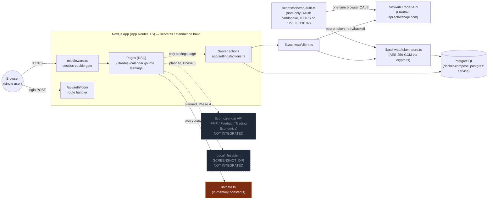
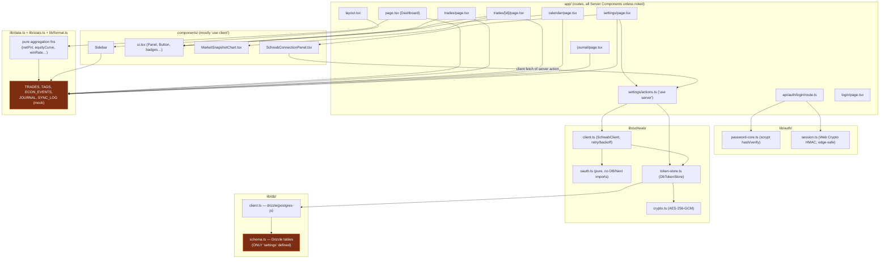
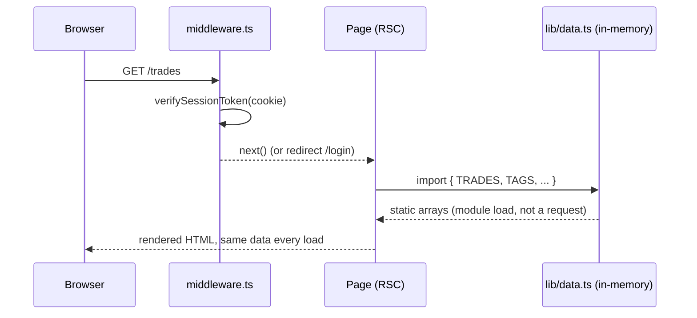
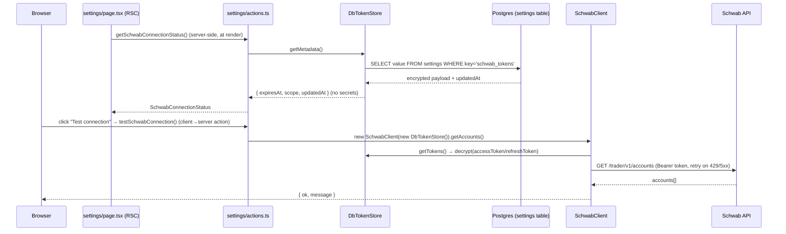
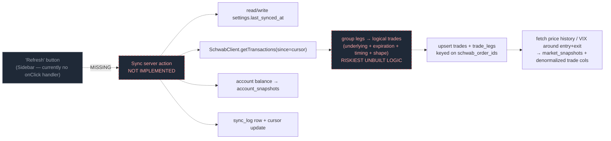

# Trading Journal — Architecture Overview

**Purpose:** A from-the-code map of what actually exists today, how the pieces connect, and where the target architecture in `design_doc.md` is not yet reached. Companion to `docs/design_doc.md` (target design) and `docs/implementation_plan.md` (gap analysis + phased plan).

---

## 1. System context

**Read of this diagram:** everything in orange (`lib/data.ts`) is hardcoded in-memory demo data that every page except Settings renders from. Only the Settings page and its server actions touch the real database and the real Schwab API. The dashed boxes (econ calendar, screenshot storage) don't exist in code yet — only as `.env.example` placeholders and design-doc sections.

---

## 2. Module layering (what imports what)

**Key structural observation:** `lib/schwab/*` and `lib/auth/*` are cleanly decoupled — pure functions, dependency-injected token stores, no page-level coupling. `lib/data.ts` is the single choke point almost every page depends on; swapping it for DB-backed reads (Phase 5 of the implementation plan) is a page-by-page, mostly mechanical migration *because* `lib/stats.ts` already isolates the aggregation logic as pure functions over a `Trade[]` array.

---

## 3. Database: designed vs. actual

`design_doc.md` §4 specifies 11 tables. Only one is defined in `lib/db/schema.ts` and migrated (`drizzle/0000_overjoyed_betty_brant.sql`):

| Table (design doc §4) | Status |
|---|---|
| `settings` | ✅ Exists — repurposed to hold the encrypted Schwab token payload (key `schwab_tokens`), not just app config |
| `accounts` | ❌ Not defined |
| `account_snapshots` | ❌ Not defined |
| `trades` | ❌ Not defined |
| `trade_legs` | ❌ Not defined |
| `tags` | ❌ Not defined |
| `screenshots` | ❌ Not defined |
| `market_snapshots` | ❌ Not defined |
| `daily_journal` | ❌ Not defined |
| `econ_events` | ❌ Not defined |
| `sync_log` | ❌ Not defined |

---

## 4. Current data flow — every page except Settings

No network/DB round trip happens for Dashboard, Trades, Trade Detail, Calendar, or Journal — the "data fetch" is a JS module import evaluated once per server process. Editing a trade's journal fields, uploading a screenshot, adding a tag, or clicking "Refresh" currently changes nothing (no handlers wired, or the handler is missing entirely).

## 5. Current data flow — Settings page (the one real integration)

This is the one path in the app doing what the design doc describes end-to-end: encrypted-at-rest tokens, real OAuth, real API call, non-secret status surfaced to the client.

## 6. Designed but unbuilt — EOD sync pipeline (design_doc.md §5)

Nothing past `SchwabClient` (transactions/price-history/quotes methods exist and are typed) is implemented. The Sidebar's "Refresh" button (`components/Sidebar.tsx`) renders but has no `onClick`.

---

## 7. Verification of `docs/implementation_plan.md`

Checked every factual claim in the plan against the actual files. **The plan is accurate — no false claims found.** Two things are worth calling out, both understatements/nuances rather than errors:

### 7.1 Confirmed correct
- **"Current State" section** — every bullet checked out: frontend pages all import from `lib/data.ts`; `lib/stats.ts` aggregations are pure functions with no side effects; auth is scrypt (`lib/auth/password-core.ts`) + Web-Crypto HMAC session (`lib/auth/session.ts`, edge-safe by design) + middleware redirect; Schwab OAuth/client/encrypted token store/host script/status actions all exist and work as described; only `settings` is defined in `lib/db/schema.ts`; `docker-compose.yml` + `web.Dockerfile` exist.
- **Feature gaps A–H** — all genuinely absent from the code (no `trades`/`trade_legs`/etc. schema, no sync action, no manual-field save action, no upload handler, no econ-events fetch, tag management UI has no submit handler, Sidebar "Refresh" has no handler).
- **Phase 0 checkmarks** — `.env.example` really does have `SCREENSHOT_DIR`, `ECON_API_PROVIDER`, `ECON_API_KEY` as claimed; `scripts/migrate.ts` + `db:up`/`predev`/`prestart` npm scripts really exist as claimed.
- **Dependency ordering (Phase 1 → 2 → {3,4} → 5 → {6 parallel} → 7 → 8)** is sound: 3 and 4 only need the schema (not the sync pipeline), 5 genuinely needs 2+3+4 for real data to display, 6 is correctly flagged as independently parallelizable.

### 7.2 One overstated checkmark
Phase 0.2 marks auto-migration "✅ Done" based on the `predev`/`prestart` npm lifecycle hooks. That's true for `npm run dev` and `npm start` — but **`web.Dockerfile`'s final stage runs `CMD ["node", "server.js"]` directly**, not `npm start`, so the `prestart` hook never fires inside the actual container build. Migrations will *not* run automatically in the dockerized deployment path as currently written; someone has to run `npm run db:up` manually against that environment first. This isn't a contradiction of the plan — Phase 8.2 ("Auto-migrate on deploy — entrypoint step") already lists this as unfinished work — but the Phase 0.2 checkmark reads as more complete than it is for the container path specifically.

### 7.3 One gap the plan doesn't mention
Phase 2.3 calls for building the leg-grouping algorithm "with unit tests over fixtures" and flags it as the riskiest logic in the whole project. There is currently **no test runner in the project** — no `vitest`/`jest` in `package.json` devDependencies, no test script, no `__tests__`/`*.test.ts` files anywhere. Worth adding "pick and wire a test runner" as an explicit Phase 2.0/2.3 sub-step rather than assuming it's already available, since that's the one phase where the plan itself says tests matter most.

### 7.4 Minor, unrelated to the plan's scope
- `Sidebar.tsx` hardcodes "Schwab connected" and `LAST_SYNC` from mock data regardless of actual connection state — while `settings/page.tsx` correctly shows live status via `getSchwabConnectionStatus()`. Two different truths about the same fact are shown on the same screen today. Covered implicitly by Phase 5.7 ("remove static mock fallbacks") but worth naming explicitly when that phase is scoped.
- `web.Dockerfile`'s `deps` stage runs `npm install` (not `npm ci`) and only copies `package.json` (not `package-lock.json`), so the container's installed versions aren't guaranteed to match the committed lockfile. Not in the plan's scope (Phase 7/8, ops polish) but adjacent to Phase 8.2's Docker work.

**Bottom line:** the plan's understanding of the codebase is trustworthy — you can execute it as written. Fold in a test-runner decision before Phase 2.3, and treat Phase 8.2's "auto-migrate on deploy" as covering a real, currently-unmet gap (not a redundant nice-to-have).
